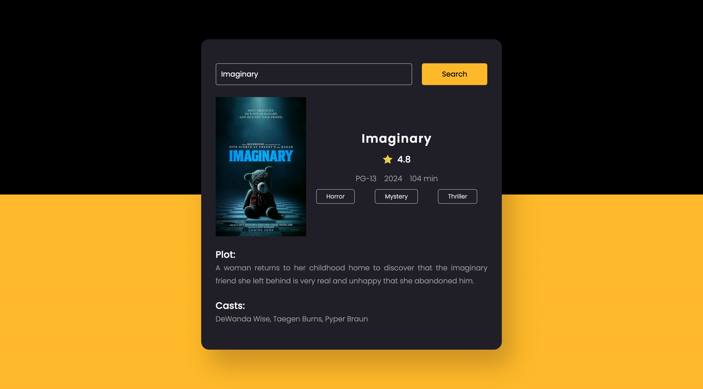

# movie-guide
Movie Guide

This App provides functionality for a movie search application using the OMDB API.

## Usage

## Features

- **Search Functionality**: Enter the name of a movie and click the search button to fetch details about the movie from the OMDB database.
- **Display Movie Details**: Upon successful search, the script retrieves information such as movie title, poster, rating, release year, runtime, genre, plot, and cast. It dynamically populates the result container with this information.
- **Error Handling**: The script handles various scenarios such as empty input, movie not found, and network errors gracefully, providing informative messages to the user.

## How to Use

1. Enter the name of the movie you want to search for in the input field.
2. Click the search button.
3. Wait for the script to fetch and display the movie details.
4. If the movie is found, you'll see its details including title, poster, rating, release year, runtime, genre, plot, and cast.
5. If there's an error, such as an empty input, movie not found, or a network error, you'll see an appropriate error message.

## Dependencies

- This script relies on the Fetch API to make HTTP requests.
- It requires access to the OMDB API. Get your API key from the OMDB website.